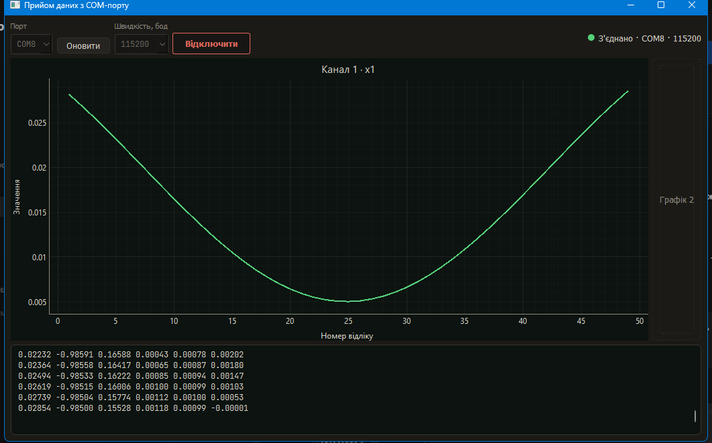
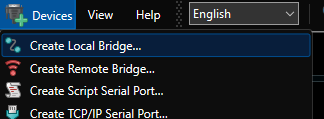
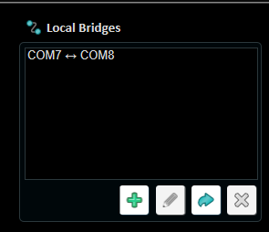
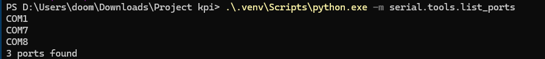
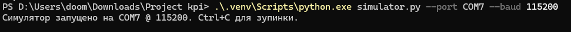
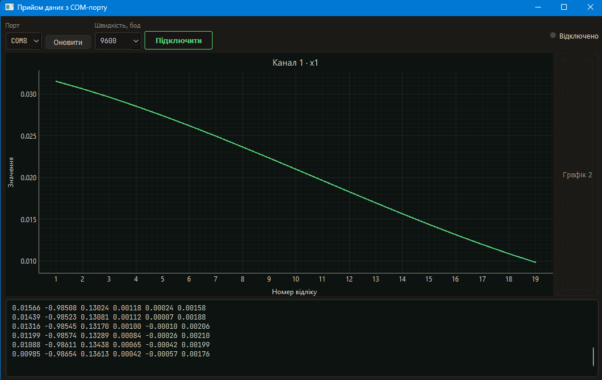

# Прийом даних із COM-порту

Навчальний застосунок на Python і PySide6: приймає дані через serial-порт, показує сирий текст і будує графік першого значення `x1`. У комплекті є симулятор, тому перевірити роботу можна без фізичного пристрою.



## Що вже працює

- Вибір порту й швидкості: 9600, 57600 або 115200 бод.
- Реальне відкриття та закриття порту, індикатор стану й повідомлення про помилки.
- Читання через `QTimer` кожні 50 мс із `timeout=0`.
- Текстовий лог з автопрокруткою й обмеженням у 500 текстових блоків.
- Графік `x1` з останніми 500 відліками: горизонтальна вісь — номер відліку, вертикальна — значення.
- Симулятор шести значень і окремий консольний скрипт для діагностики прийому.

Другий графік поки є заглушкою. Структурованої таблиці, експорту у файл і окремого потоку `QThread` ще немає. Читання виконується в потоці GUI; поточна реалізація призначена для невеликого потоку даних, як у симуляторі.

## Встановлення у Windows

Потрібен Python; для повторення демонстрації використано Python 3.13 та Windows 11. Залежності зафіксовані в `requirements.txt`: PySide6, pyserial і pyqtgraph.

Завантажте або клонуйте репозиторій, відкрийте його папку у VS Code через **File → Open Folder**, а потім відкрийте термінал PowerShell. Переконайтеся, що поточна папка містить `main.py` і `requirements.txt`.

Виконуйте команди **окремими рядками**:

```powershell
py -3.13 -m venv .venv
.\.venv\Scripts\python.exe -m pip install -r requirements.txt
.\.venv\Scripts\python.exe main.py
```

Якщо команда `py` недоступна, створіть середовище командою `python -m venv .venv`, використовуючи встановлений Python. Інші команди залишаються тими самими.

Активувати `.venv` не потрібно: команди напряму викликають його Python. Це також дозволяє працювати, коли PowerShell забороняє запуск `Activate.ps1`.

Для кнопки запуску у VS Code виберіть **Ctrl+Shift+P → Python: Select Interpreter → Enter interpreter path** та вкажіть `.venv\Scripts\python.exe` у папці проєкту. Після перенесення проєкту на інший ПК створіть середовище заново — не копіюйте старі `venv` або `.venv`.

Інтерфейс використовує шрифти Roboto Condensed і JetBrains Mono; якщо їх немає, система підставить доступний шрифт.

## Демонстрація без пристрою

### 1. Створіть віртуальну пару

Потрібні два з'єднані віртуальні COM-порти. Симулятор сам їх не створює.

У показаній демонстрації використано [HHD Virtual Serial Ports](https://hhdsoftware.com/virtual-serial-ports): **Devices → Create Local Bridge…**, пара **COM7 ↔ COM8**. Умови ліцензії та пробної версії перевіряйте на сайті виробника. Якщо ці номери зайняті, виберіть інші та замініть їх у командах нижче.

Відкрийте меню **Devices** та виберіть **Create Local Bridge…**:



У вікні створення задайте два вільні порти, наприклад **COM7** і **COM8**, та підтвердьте. У списку **Local Bridges** має з'явитися з'єднання **COM7 ↔ COM8**:



Перевірте порти з папки проєкту:

```powershell
.\.venv\Scripts\python.exe -m serial.tools.list_ports
```



Сам список портів не підтверджує, що вони з'єднані між собою: пару потрібно створити в емуляторі.

### 2. Запустіть симулятор

У першому терміналі:

```powershell
.\.venv\Scripts\python.exe simulator.py --port COM7 --baud 115200
```



Залиште цей термінал відкритим. За замовчуванням симулятор надсилає один рядок кожні 0,1 секунди. Інтервал можна змінити:

```powershell
.\.venv\Scripts\python.exe simulator.py --port COM7 --baud 115200 --interval 0.2
```

### 3. Підключіть GUI

У другому терміналі з тієї самої папки запустіть:

```powershell
.\.venv\Scripts\python.exe main.py
```

У вікні програми:

1. Натисніть **Оновити**.
2. Виберіть **COM8** — другий кінець пари.
3. Встановіть **115200** бод. Початкове значення в GUI — **9600**, його потрібно змінити для цієї демонстрації.
4. Натисніть **Підключити**.

Зелений індикатор і статус `З'єднано · COM8 · 115200` означають, що порт відкрито. У лозі з'являться числа, а на графіку — плавна крива.

### 4. Зупиніть прийом

**Відключити** зупиняє таймер і закриває порт GUI. Накопичений графік і лог залишаються на екрані. Наступне успішне підключення очищає графік і починає нумерацію відліків заново; лог зберігається в межах свого ліміту.



На цьому скриншоті вже вибрано 9600 бод у відключеному стані; для повторного запуску демонстрації встановіть 115200.

Щоб зупинити симулятор, натисніть **Ctrl+C** у його терміналі. Закриття вікна GUI також закриває його serial-порт.

## Як передаються дані

```text
simulator.py → COM7 ══ віртуальна пара ══ COM8 → QTimer → сирий лог
                                                   └→ повний рядок → графік x1
```

Симулятор обчислює шість значень за синусоїдальними формулами та надсилає їх як ASCII-текст:

```text
0.02232 -0.98591 0.16588 0.00043 0.00078 0.00202
```

Порядок значень: `x1 y1 z1 x2 y2 z2`. Кожен рядок закінчується `\r\n`; числа розділені пробілами, десятковий роздільник — крапка.

GUI декодує сирі байти як UTF-8 із заміною некоректних символів і показує текст у лозі. Для графіка він чекає завершення рядка `\n`, перетворює рівно шість полів на числа та бере перше — `x1`. Рядки з некоректними числами, `NaN`, нескінченністю або довжиною понад 4096 байтів не потрапляють на графік, але залишаються в сирому лозі.

`timeout=0` дозволяє читати без очікування нових байтів. Через це один рядок може надійти частинами: для графіка такі частини накопичуються до кінця рядка. Частота таймера не є частотою вимірювань: один його виклик може прочитати кілька рядків або жодного.

Для реального пристрою виберіть його COM-порт і відповідну швидкість. Лог показуватиме отриманий текст; для побудови графіка пристрій має надсилати описаний вище формат.

## Якщо щось не працює

| Симптом | Що перевірити |
| --- | --- |
| `ModuleNotFoundError: No module named 'PySide6'` | Встановіть залежності через `.\.venv\Scripts\python.exe -m pip install -r requirements.txt` і запускайте GUI цим самим Python. |
| `requirements.txt` не знайдено | Перейдіть у папку проєкту; термінал може бути відкритий у папці VS Code або користувача. |
| PowerShell забороняє `Activate.ps1` | Активація не потрібна: використовуйте прямі команди з `.venv`, наведені вище. |
| `FileNotFoundError` під час відкриття COM-порту | Перевірте фактичні назви портів командою `serial.tools.list_ports` та стан пари в емуляторі. |
| `Access is denied` | Порт може бути зайнятий. Симулятор має відкривати COM7, GUI — COM8. Закрийте інші програми, що використовують потрібний порт. |
| Видно лише COM1 | Віртуальна пара не створена або її драйвер не працює. Перевірте емулятор і диспетчер пристроїв. |
| com0com має Code 52 | Windows не може перевірити підпис драйвера. У демонстрації цю проблему обійшли використанням HHD; перейменування портів її не виправляє. |
| Порт відкритий, але даних немає | Перевірте, що симулятор працює на іншому кінці тієї самої пари, а швидкості збігаються. |
| Лог оновлюється, графік — ні | Потрібні рівно шість скінченних чисел у рядку та завершення `\n`. |

Для перевірки прийому без GUI спочатку відключіть GUI від COM8, залиште симулятор працювати й виконайте:

```powershell
.\.venv\Scripts\python.exe read_test.py --port COM8 --baud 115200
```

Зупинка — **Ctrl+C**. Після цього порт знову можна відкрити в GUI.

## Файли проєкту

| Файл | Призначення |
| --- | --- |
| `main.py` | Запуск QApplication та головного вікна. |
| `main_window.py` | Інтерфейс, serial-підключення, таймер, лог і графік. |
| `simulator.py` | Генератор шести синтетичних значень. |
| `read_test.py` | Консольна перевірка прийому. |
| `requirements.txt` | Залежності Python. |
| `docs/images/` | Скриншоти демонстрації. |

Можливі наступні етапи: винести читання в `QThread`, додати решту кривих і другий графік, структуровану таблицю та збереження даних.
